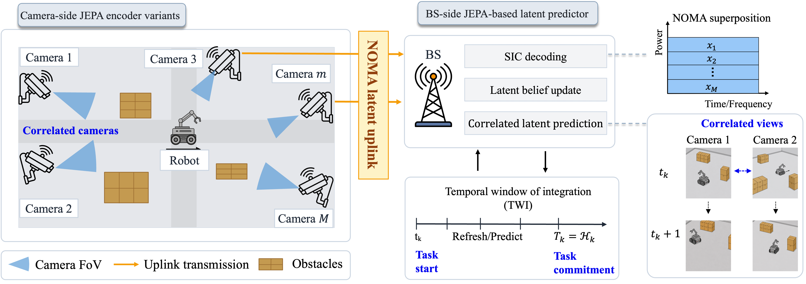
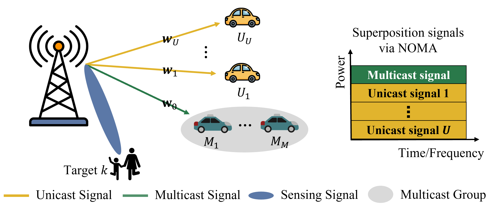
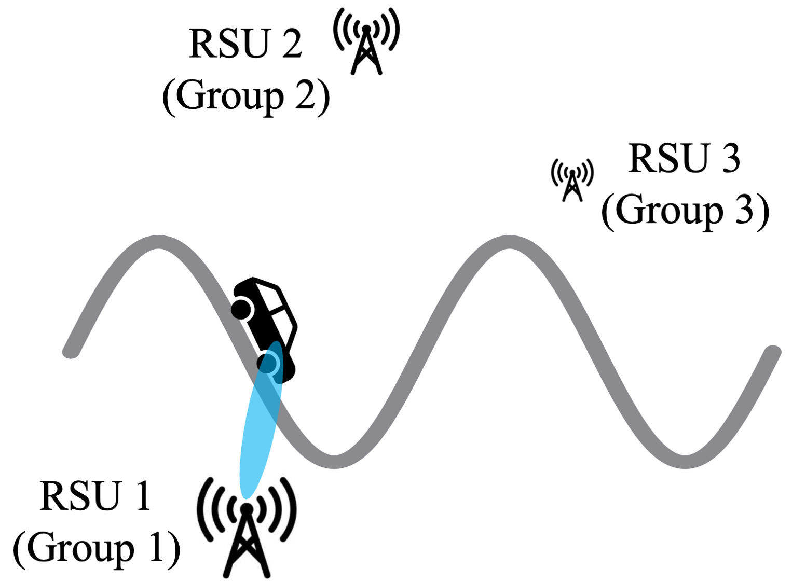
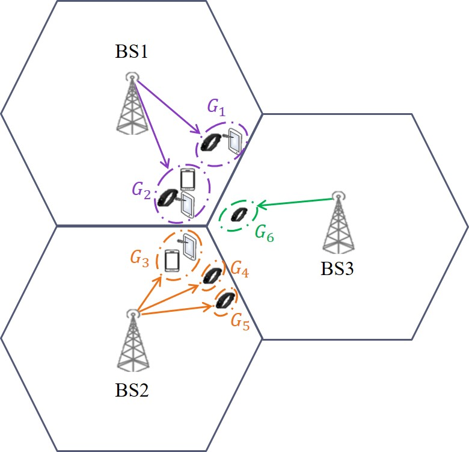
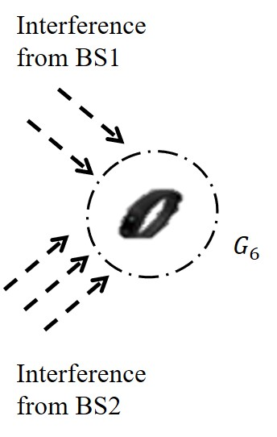
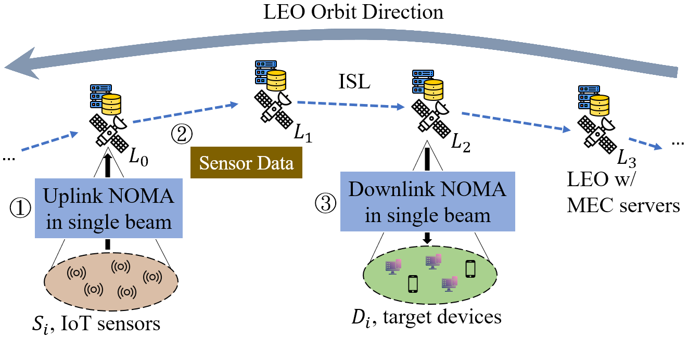
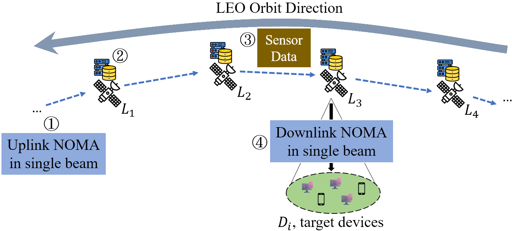

::: {.paper-project}

Preprint · arXiv 2026

## Joint Age-of-Latent and Resource Minimization for Wireless Multi-Camera Perception With Temporal Window Selection

::: {.paper-figure}
{fig-alt="Fig. 1. System model of the proposed multi-camera wireless perception framework: correlated cameras upload JEPA latent representations over a NOMA uplink to a base station that maintains and predicts latent beliefs within a temporal window of integration."}
:::



Abstract

Multi-camera wireless perception requires a base station (BS) to maintain timely and reliable latent beliefs from distributed cameras under limited uplink resources. Conventional Age-of-Information (AoI) measures the age of the latest received update but not task-relevant latent content. We introduce Age-of-Latent (AoL) to quantify the freshness of each camera's latest decoded latent representation. A finite temporal window of integration (TWI) determines the task-commitment time and available uplink slots, creating a tradeoff among update opportunities, prediction duration, commit-time AoL, prediction reliability, and accumulated resource cost. Within this horizon, redundant or overlapping views enable correlated prediction, reducing reliance on the highest-cost communication and encoding configuration to maintain BS-side latent beliefs. We formulate a joint AoL-resource minimization problem coupling task-level TWI selection with slot-level encoder selection, scheduling, and NOMA power allocation under prediction-reliability constraints. We propose correlation-aware latent prediction for AoL minimization (CoLA), which uses Lyapunov optimization for task-level TWI selection based on AoL-resource cost and prediction uncertainty, and proximal policy optimization for slot-level resource control. Results on a warehouse multi-camera RF dataset show that CoLA adapts the TWI to camera-update availability and achieves the most favorable AoL-resource tradeoff among the benchmarks while maintaining prediction reliability, particularly under prolonged and severe camera outages.

[Read on arXiv](https://arxiv.org/abs/2608.09411){.paper-link target="_blank" rel="noopener"}
:::

::: {.paper-project}

IEEE Transactions on Mobile Computing · 2026

## AoI Minimization for Task-Oriented ISCC Networks with NOMA-Assisted Multicast-Unicast Transmissions
::: {.paper-figure}
{fig-alt="Fig. 2. System model for the ISCC vehicular network."}
:::



Abstract

Integrated sensing and communication (ISAC) is a key enabler for 6G intelligent transportation systems, where the timely delivery of processed sensing information is essential for safety-critical Internet of Vehicles (IoV) applications. While Age of Information (AoI) has emerged as an important freshness metric, existing AoI minimization frameworks typically ignore task processing delays, limiting their applicability to computation-intensive IoV workloads. This motivates the shift toward integrated sensing, communication, and computation (ISCC). Although non-orthogonal multiple access (NOMA) improves spectral efficiency when sensing and communication contend for radio resources, conventional unicast dissemination incurs redundant transmissions, whereas broadcast approaches suffer from low decoding reliability. To overcome these limitations, we propose a computation-aware NOMA-ISCC framework that jointly optimizes task scheduling, beamforming, and power allocation to minimize the expected weighted sum AoI (EWSAoI) under stringent latency constraints. We develop a hybrid multicast–unicast transmission design, where identical sensing information is multicast and vehicle-specific data is unicast, and leverage NOMA superposition to enable concurrent target detection without incurring additional power cost. To solve the resulting mixed discrete–continuous, non-convex control problem, we design a Transformer-based Hybrid Proximal Policy Optimization (THPPO) algorithm that efficiently handles hybrid action spaces and generalizes across varying network densities. Extensive simulations show that the proposed framework substantially lowers EWSAoI relative to state-of-the-art benchmarks while improving spectral efficiency and latency reliability. Moreover, the system demonstrates strong scalability by preserving freshness and deadline reliability under larger and time-varying network scales.

[View on IEEE Xplore](https://doi.org/10.1109/TMC.2026.3722622){.paper-link target="_blank" rel="noopener"}
:::

::: {.paper-project}

IEEE GLOBECOM · Accepted 2026

## Information-Rich Predictive Beamforming in Multi-RSU Systems via Joint Monostatic and Bistatic Sensing

::: {.paper-figure}
{fig-alt="Overview of the multi-RSU ISAC system: spatially separated RSUs jointly sense a vehicle via monostatic and bistatic links."}
:::



Abstract

Integrated sensing and communication (ISAC) enables predictive beamforming in vehicular networks by extracting mobility information directly from communication waveforms. However, existing ISAC-based predictive beamforming approaches are predominantly designed for single roadside unit (RSU) architectures, where sensing observations are dominated by monostatic, radial-velocity components. This intrinsic sensing geometry fundamentally limits motion observability and leads to degraded prediction accuracy under high mobility and complex road geometries. This paper investigates predictive beamforming in a distributed multi-RSU ISAC system that jointly exploits monostatic and bistatic sensing without requiring dedicated sensing waveforms or extra signaling overhead. By reusing standard OFDM waveforms with interleaved sensing subcarriers, spatially separated RSUs provide information-rich, multi-perspective observations that significantly enhance vehicle motion characterization. Building on this sensing architecture, we propose MR-CLNet, an end-to-end spatio-temporal learning framework that directly maps multi-RSU sensing observations to future beam directions without explicit intermediate motion estimation. Simulation results demonstrate that the proposed approach consistently outperforms single-RSU and representative learning-based baselines in terms of angle prediction accuracy and average achievable rate, with particularly pronounced gains under high-mobility and curved-road scenarios.

:::

::: {.paper-project}

IEEE Transactions on Wireless Communications · 2024

## AoI-Aware Interference Mitigation for Task-Oriented Multicasting in Multi-Cell NOMA Networks
::: {.paper-figure .paper-figure-pair}
{fig-alt="Fig. 2: Cell-edge groups may be prone to inter-cell interference in a multi-cell multicast NOMA network."}

{fig-alt="Fig. 2: Cell-edge group G6 in BS3 experiences inter-cell interference from two sources in BS1 and three sources in BS2."}
:::



Abstract

Age of Information (AoI) is a critical performance metric for measuring information freshness in task-oriented Internet of Things (IoT) applications. In this work, we investigate how AoI impacts task-oriented multicasting in multi-cell Non-orthogonal Multiple Access (NOMA) networks, while considering the effects of inter-cell interference and multicast group size. Our findings reveal that larger group sizes lead to increased instability in AoI, but lower inter-cell interference; while smaller group sizes result in higher inter-cell interference but a smaller increase in AoI when transmission fails. To balance inter-cell interference and group size, we propose a novel AoI-aware inter-cell interference mitigation (AIM) solution, which dynamically adjusts multicast group size, schedules multicast groups for transmission, and allocates transmit power to multicast groups. We derive the optimality for achieving the lowest AoI of the AIM scheduling strategy and the upper bound of the number of scheduling groups. Our simulation results show that AIM ensures more successful transmissions and low weighted sum AoI through grouping and AoI-aware inter-cell interference mitigation. We also show that our AoI-aware grouping scheme outperforms random grouping and fixed grouping, as well as evolutionary-based genetic algorithm grouping, by modeling the grouping problem as a multi-armed bandit problem and solving it using the ϵ-greedy method. To the best of our knowledge, this is the first study to examine the AoI problem of task-oriented IoT applications in multi-cell multicast NOMA networks.

[View on IEEE Xplore](https://doi.org/10.1109/TWC.2024.3381480){.paper-link target="_blank" rel="noopener"}
:::

::: {.paper-project}

IEEE VTC-Spring · 2024

## Energy-aware Age of Information (AoI) Minimization for Internet of Things in NOMA-based LEO Satellite Networks

::: {.paper-figure .paper-figure-pair}
{fig-alt="Fig. 1(a). UL and DL transmissions via ISLs — Scenario 1: without a handover process."}

{fig-alt="Fig. 1(b). UL and DL transmissions via ISLs — Scenario 2: with a handover process."}
:::



Abstract

In this paper, we explore the problem of minimizing the uplink and downlink age of information (AoI) in non-orthogonal multiple access (NOMA)-based low Earth orbit (LEO) networks for Internet of Things (IoT) devices. The objective is to effectively manage the freshness of information across IoT devices while maintaining a fair power allocation over time. We propose two novel AoI models that accurately capture the freshness of information for devices during both uplink and downlink transmissions, accounting for factors such as propagation delay, satellite handover delay, and inter-satellite link transmission time. To minimize the time-average AoI, we propose an energy-aware AoI (EA-AoI) algorithm that combines a deep reinforcement learning (DRL)-based scheduling approach with a low-complexity power allocation scheme. Simulation results demonstrate that the proposed EA-AoI scheduling algorithm outperforms successive interference cancellation (SIC)-based scheduling, AoI-greedy scheduling, and random scheduling approaches in terms of lower AoI values in the uplink and downlink directions through both simulated and real-world satellite trajectories. Furthermore, the algorithm ensures that the long-term average allocated power remains within a predefined threshold, thus striking an optimal balance between AoI and power consumption for NOMA-based LEO satellite networks.

[View on IEEE Xplore](https://ieeexplore.ieee.org/document/10683037/){.paper-link target="_blank" rel="noopener"}
:::

::: {.figure-credit}
Figures are reproduced from the author's papers cited above. © IEEE, where applicable.
:::
